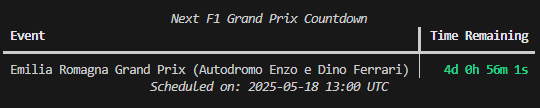

# F1 Race Countdown CLI Tool



A lightweight Python CLI that counts down in your terminal to the next 2025 F1 Grand Prix using a static race calendar and Rich for styling.

---

## Table of Contents

1. [Description](#description)  
2. [Why I Built This](#why-i-built-this)  
3. [Features](#features)  
4. [Installation](#installation)  
5. [Usage](#usage)  
6. [Customization](#customization)  
7. [Future Improvements](#future-improvements)  
8. [License & Portfolio](#license--portfolio) 

---

## Description

The **F1 Race Countdown CLI Tool** is a lightweight, terminal-based application that displays a live countdown to the next Formula 1 Grand Prix. Rather than relying on existing services, this project showcases how to fetch and process race data, calculate time deltas, and render styled output using Python and the Rich library.

---

## Why I Built This

1. I’m a massive Formula 1 enthusiast, and I desire to be a part of the community that’s driving innovation and taking the sport to new heights. Building my own countdown tool helps me practice my coding skills and eventually do just that.

2. I believe the greatest satisfaction comes from crafting something yourself. Developing this CLI gave me the thrill of seeing my code bring real‑time race anticipation to life in my own terminal.

3. I’m eager to deepen my Python skills—parsing dates, handling data structures, and designing user‑friendly CLIs. This project was a perfect sandbox to apply new concepts and libraries.

4. I haven’t had my first developer role yet, so each project is a stepping stone. A polished, well‑documented repo demonstrates my ability to solve problems and deliver functional tools.

5. This project is purely for enjoyment and to showcase my programming abilities in an F1 context, rather than addressing a real‑world problem.

---

## Features

- Static 2025 race calendar for easy customization
- ISO‑format date parsing with `python-dateutil`
- Live countdown in days, hours, minutes, and seconds
- Styled terminal output using the [Rich](https://github.com/Textualize/rich) library

---

## Installation

```bash
pip install python-dateutil rich
```

---

## Usage

1. Clone the repo:

```bash
git clone https://github.com/your-username/f1-race-countdown.git
cd f1-race-countdown
```

2. Run the countdown:

```bash
python f1_countdown.py
```

3. Watch the timer roll until the next Grand Prix!

---

## Customization

- To **update the calender** you can edit the `RACE_CALENDER` list in `f1_countdown.py` to add or modify races.
- You can also adjust dates or duplicate the file for **future seasons**.

---

## Future Improvements

- Package as a standalone CLI with entry points for `pip install`
- Add automated updates by fetching live schedules from an API
- Incorporate timezone detection to show local race times
- Write unit tests with `pytest` to validate countdown logic

---

## License & Portfolio

This code is part of my personal portfolio.
**© 2025 Derryl Nouvabiyanto. All Rights Reserved.**
You’re welcome to view and learn from it, but please ask before reusing it in other projects.
